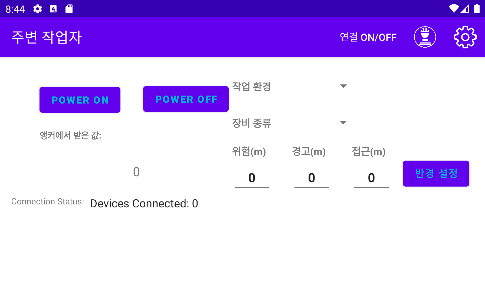

"# AndroidApp" 

정재일 교수님 연구실과 함께한 현대건설 중장비협착방지 관련 앱 개발 프로젝트입니다.
프로젝트 목적: 건설 현장 내 중장비(Anchor)와 작업자(Tag)가 혼재한 상황에서 안전성 확보를 위한 안드로이드 어플리케이션 개발

## License Information

This project is licensed for **personal use only**. Any academic or commercial use is strictly prohibited without the explicit permission of the author.
For more details, please refer to the [LICENSE](./LICENSE) file.
If you wish to use this software for academic or commercial purposes, please contact the author at [cbcc12345@hanyang.ac.kr] or [cbcc1234@gmail.com].
Unauthorized use may result in legal action.
